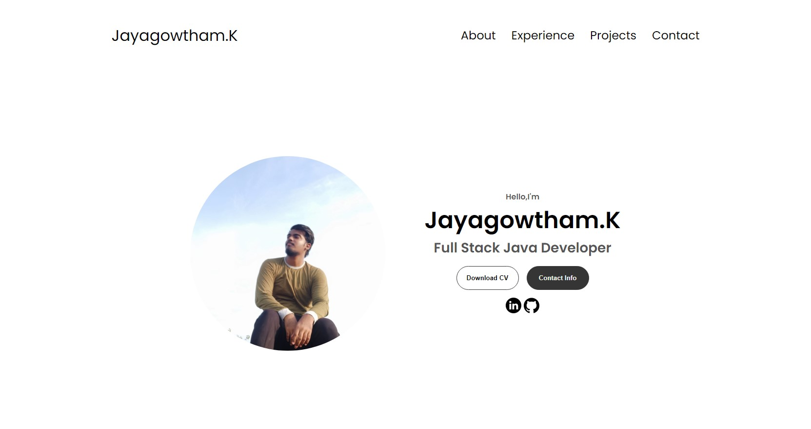
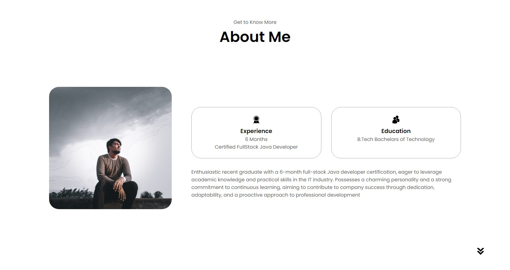
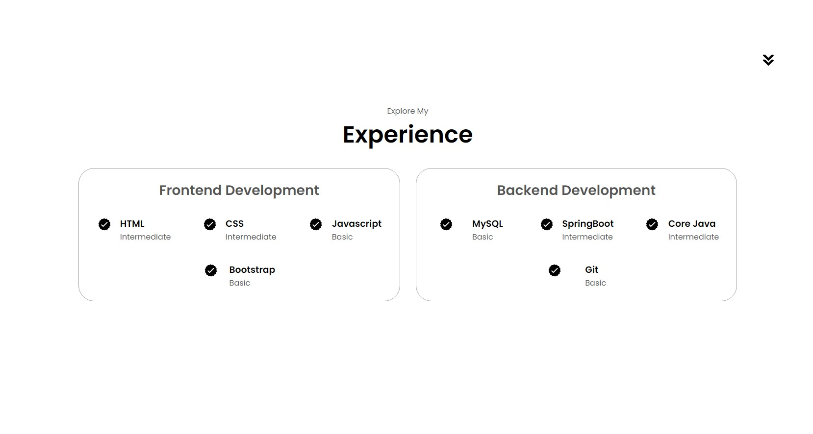
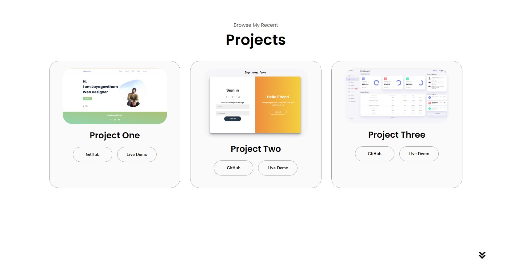
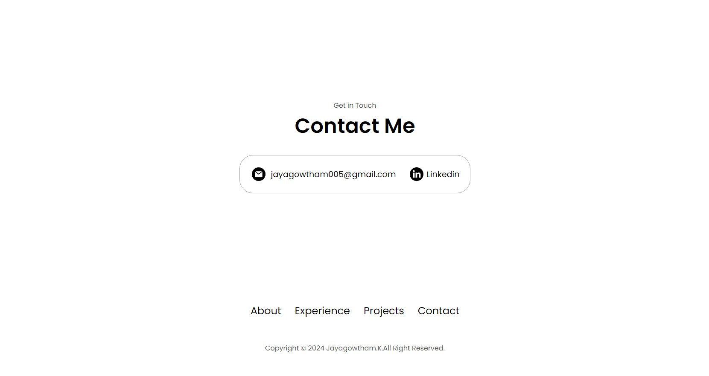

# Personal-Portfolio
- In this repo it contains the source code for HTML, CSS and Javascript I used to create a simple and well texted Portfolio Website to showcase myself.
- for a developer a personal website is important and shows his work and his personal information through it and tells how much he have learnt.
## Things covered:
- In this project i have covered different sections and marked through my code
- The nav tab and hamburger menu. profile, Experience, Projects, Contact info.
- from this website itself you can goto my Linkedin page and GitHub profile and check my other projects.
- Also you can download my Resume from this.
## Media Query
- and this website is made suitable for you mobile version too.
## All the Sections are mentioned separatly and explained. If any doubt please contact me through GitHub.

### Result Img of Portfolio:
- Intro/Starting

- Profile

- Experience

- Projects

- Contact Info
